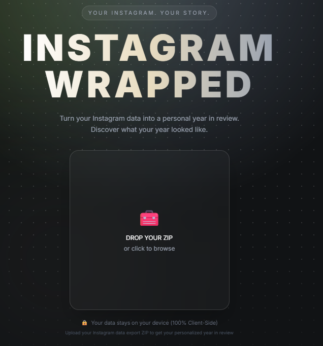
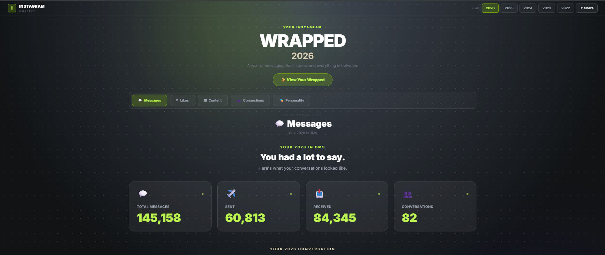
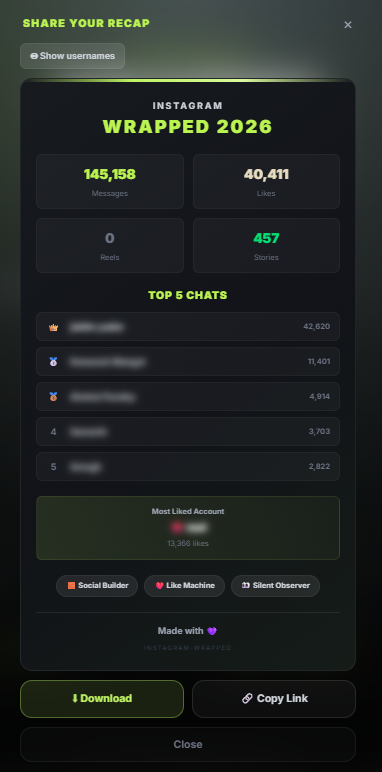

# 📸 Instagram Wrapped

**Your Instagram. Your data. Your story.**

[](https://instagram-wrapped-tau.vercel.app/)
[](https://react.dev/)
[](https://www.typescriptlang.org/)
[](https://tailwindcss.com/)
[](https://vite.dev/)

> A privacy-first Instagram analytics dashboard that turns your Instagram data export into a personalized yearly Wrapped experience.

**[Live Demo](https://instagram-wrapped-tau.vercel.app/)** · **[GitHub Repository](https://github.com/HarshAwasth-i/instagram-wrapped)**

---

## 📌 Navigation

- [✨ Features](#-features)
- [🔒 Privacy](#-privacy)
- [🚀 Getting Started](#-getting-started)
- [📖 How to Use](#-how-to-use)
- [🛠 Tech Stack](#-tech-stack)
- [🏗️ Architecture](#️-architecture)
- [📁 Project Structure](#-project-structure)
- [📊 Supported Data](#-supported-data)
- [🎨 Design Philosophy](#-design-philosophy)
- [📸 Screenshots](#-screenshots)
- [🔮 Future Improvements](#-future-improvements)
- [🤝 Contributing](#-contributing)
- [👨‍💻 Author](#-author)

---

## ✨ Features

### 📊 Instagram Analytics

Turn your Instagram data export into meaningful statistics and visual insights.

| Feature | Description |
|---|---|
| **Message Analytics** | Total messages, sent vs received, active hours, and top conversations |
| **Like Statistics** | Total likes given, monthly activity, and most liked accounts |
| **Content Analysis** | Posts, stories, and monthly content activity |
| **Connection Insights** | Followers, following, mutuals, and accounts not following back |
| **Search Behavior** | Search activity and frequently searched accounts or terms |
| **Login Activity** | Login activity from your Instagram export |
| **Personality Insights** | Fun personality tags based on Instagram activity |

### 💬 Message Insights

Explore your messaging behavior throughout the year:

- 💬 Total messages
- 📤 Sent vs received messages
- 🏆 Top conversations
- ⏰ Most active messaging hours
- 📅 Monthly messaging activity
- 👥 Top friends and conversations
- 🕐 First and last message activity

### ❤️ Like Statistics

Understand your Instagram engagement:

- Total likes given
- Most liked accounts
- Monthly like activity
- Hourly like patterns
- Top liked content

### 🎬 Content Analysis

See how your content activity changes throughout the year:

- 📝 Post activity
- 📖 Story activity
- 🎞️ Reel statistics when available in the export
- 📅 Monthly content trends
- 📈 Most active months

### 👥 Connection Insights

Understand your Instagram network:

- 👤 Followers
- 📈 Following
- 🤝 Mutual followers
- 🚫 Accounts not following you back
- 🔄 Connection relationships

### 🔎 Search & Login Activity

Explore additional activity from your Instagram export:

- 🔍 Search history
- 📊 Most frequent searches
- 🔐 Login activity
- 📅 Year-based activity filtering

### 🧠 Personality Insights

Get fun personality tags generated from your Instagram activity.

Examples include:

- 🧱 **Social Builder** — Maintains many active conversations
- ❤️ **Like Machine** — Shows love across Instagram
- 👀 **Silent Observer** — Likes more than talks
- 👻 **Ghost Poster** — Rarely posts but stays active
- 💕 **Loyal Friend** — Has a best friend they message frequently

### 🎞️ Wrapped Experience

Turn your analytics into an interactive story experience:

- Year summary
- Message highlights
- Top friends
- Like activity
- Content activity
- Most active month
- Connection statistics
- Personality insights
- Animated transitions
- Autoplay
- Progress indicators
- Keyboard navigation
- Pause and resume controls

### 📤 Share Your Recap

Create a personalized recap card containing:

- 💬 Messages
- ❤️ Likes
- 🎞️ Reels
- 📖 Stories
- 🏆 Top 5 conversations
- ❤️ Most liked account
- 🧠 Personality insights
- 🔒 Optional username blurring
- 📥 Downloadable recap image

### 📅 Multi-Year Support

- Automatically detect available years
- Switch between different years
- Recalculate analytics for the selected year
- Generate Wrapped experiences for the selected year
- Persist the selected year across refreshes

---

## 🔒 Privacy

[](https://instagram-wrapped-tau.vercel.app/)

### Your Instagram data stays on your device.

Instagram exports contain highly personal information, so privacy was a core design requirement of this project.

### 🔐 How Privacy Works

Your data follows this flow:

```text
Instagram ZIP
     ↓
   Browser
     ↓
 JSON Parser
     ↓
Analytics Engine
     ↓
  Dashboard
     ↓
Wrapped Experience
```

There is no backend server required to process your Instagram data.

- ✅ ZIP processing happens in the browser
- ✅ JSON data is parsed locally
- ✅ Analytics are calculated locally
- ✅ No Instagram data needs to be uploaded to a server
- ✅ Data can persist locally in the browser
- ✅ Username blur is available when sharing recap cards

---

## 🚀 Getting Started

### Prerequisites

Make sure you have the following installed:

- [Node.js](https://nodejs.org/) 18+
- npm

### 1. Clone the Repository

```bash
git clone https://github.com/HarshAwasth-i/instagram-wrapped.git
```

### 2. Navigate to the Project

```bash
cd instagram-wrapped
```

### 3. Install Dependencies

```bash
npm install
```

### 4. Start the Development Server

```bash
npm run dev
```

The application will be available at:

```text
http://localhost:5173
```

### 5. Build for Production

```bash
npm run build
```

### 6. Preview the Production Build

```bash
npm run preview
```

---

## 📖 How to Use

### 1️⃣ Download Your Instagram Data

1. Open Instagram.
2. Go to **Settings → Accounts Center → Your information and permissions**.
3. Select **Download your information**.
4. Request your Instagram information.
5. Select **JSON** format.
6. Download the generated ZIP file.

> The exact Instagram settings path may change over time.

### 2️⃣ Upload Your Data

1. Open **Instagram Wrapped**.
2. Drag and drop your Instagram ZIP file onto the upload area.
3. Or click the upload area and select your ZIP file.
4. Wait while the application processes your data locally.

### 3️⃣ Explore Your Dashboard

Explore different sections including:

- 💬 Messages
- ❤️ Likes
- 🎬 Content
- 👥 Connections
- 🔎 Search behavior
- 🔐 Login activity
- 🧠 Personality insights

### 4️⃣ Explore Wrapped

Click **Wrapped** to view your personalized story experience.

Navigate through the slides using:

- Mouse / touch
- Arrow keys
- Spacebar
- Autoplay

### 5️⃣ Share Your Recap

Open **Share Your Recap** to generate a personalized summary.

You can:

- Blur usernames
- Download the recap
- Copy the share link
- View your top conversations
- View your most liked account
- View personality insights

---

## 🛠 Tech Stack

| Technology | Purpose |
|---|---|
| **React** | Frontend UI |
| **TypeScript** | Type-safe development |
| **Vite** | Build tool and development server |
| **Tailwind CSS** | Styling and responsive UI |
| **Framer Motion** | Animations and transitions |
| **Recharts** | Data visualization |
| **JSZip** | Instagram ZIP processing |
| **IndexedDB** | Local browser persistence |
| **html-to-image** | Recap image generation |
| **Vercel** | Production deployment |

---

## 🏗️ Architecture

Instagram Wrapped separates data processing from the UI.

### 🔄 Data Flow

```text
Instagram Data Export
        │
        ▼
     ZIP Parser
        │
        ▼
    JSON Data
        │
        ▼
  Analytics Engine
        │
        ▼
 Instagram Context
        │
        ├───────────────┐
        ▼               ▼
   Dashboard        Wrapped
        │               │
        └───────┬───────┘
                ▼
          Share Recap
```

### 1. ZIP Parser

**`zipParser.ts`**

Responsible for:

- Reading the Instagram ZIP file
- Extracting JSON files
- Identifying relevant Instagram data categories
- Preparing raw data for analysis

### 2. Analytics Engine

**`dataAnalyzer.ts`**

Responsible for:

- Processing raw Instagram data
- Calculating statistics
- Filtering analytics by year
- Finding top conversations
- Calculating like and content activity
- Generating personality insights

### 3. React Context

**`InstagramContext.tsx`**

Responsible for:

- Sharing Instagram data across components
- Managing analytics state
- Managing the selected year
- Maintaining application state

### 4. Visualization Layer

React components transform calculated analytics into:

- Statistics cards
- Charts
- Activity timelines
- Connection insights
- Personality cards
- Wrapped stories
- Shareable recap cards

---

## 📁 Project Structure

```text
src/
│
├── components/
│   │
│   ├── dashboard/
│   │   ├── CategoryTabs.tsx
│   │   ├── MessageStats.tsx
│   │   ├── MessageHighlights.tsx
│   │   ├── MessageActivity.tsx
│   │   ├── LikesSection.tsx
│   │   ├── ContentSection.tsx
│   │   └── TopFriends.tsx
│   │
│   ├── sections/
│   │   ├── ConnectionsSection.tsx
│   │   └── PersonalitySection.tsx
│   │
│   ├── share/
│   │   └── ShareModal.tsx
│   │
│   ├── upload/
│   │   └── ChestUpload.tsx
│   │
│   ├── wrapped/
│   │   └── WrappedStories.tsx
│   │
│   └── layout/
│       └── Background.tsx
│
├── context/
│   └── InstagramContext.tsx
│
├── pages/
│   ├── Home.tsx
│   └── Dashboard.tsx
│
├── types/
│   └── instagram.ts
│
└── utils/
    ├── zipParser.ts
    ├── instagramParser.ts
    └── dataAnalyzer.ts
```

### Key Modules

| Module | Responsibility |
|---|---|
| `zipParser.ts` | Extracts and categorizes Instagram JSON files |
| `dataAnalyzer.ts` | Converts raw data into analytics |
| `InstagramContext.tsx` | Manages shared application state |
| `Dashboard.tsx` | Main analytics dashboard |
| `WrappedStories.tsx` | Interactive Wrapped experience |
| `ShareModal.tsx` | Shareable recap generation |
| `ChestUpload.tsx` | Instagram ZIP upload and processing |

---

## 📊 Supported Data

The application currently processes relevant data available in Instagram JSON exports, including:

- ✅ Followers
- ✅ Following
- ✅ Likes
- ✅ Comments
- ✅ Messages
- ✅ Posts
- ✅ Stories
- ✅ Search activity
- ✅ Login activity
- ✅ Connection relationships

> Instagram export formats can change over time. Analytics availability depends on the data included in the user's exported ZIP.

---

## 🎨 Design Philosophy

Instagram Wrapped was designed around a dark, immersive analytics experience inspired by modern Wrapped-style products.

### Visual Principles

- 🌑 Dark-first interface
- ✨ Minimal and clean layouts
- 🎨 Earthy neutral accent colors
- 🪟 Glassmorphism-inspired surfaces
- 🎞️ Smooth animations and transitions
- 📱 Responsive layouts
- 📊 Data-focused visualization
- 🔒 Privacy-first user experience

The goal was to make analytics feel less like a traditional dashboard and more like a personalized story.

---

## 📸 Screenshots

> Add screenshots to the `screenshots/` folder and keep these paths unchanged.

### 🏠 Landing Page



### 📊 Analytics Dashboard



### 🎞️ Wrapped Experience


### 📤 Share Your Recap



---

## 🌐 Live Demo

Try the deployed application:

### [🚀 Instagram Wrapped](https://instagram-wrapped-tau.vercel.app/)

Upload your Instagram data export ZIP and generate your personalized analytics directly in the browser.

---

## 🔮 Future Improvements

- [ ] More Instagram export format compatibility
- [ ] More advanced year-over-year comparisons
- [ ] Additional engagement analytics
- [ ] More detailed content insights
- [ ] Additional Wrapped themes
- [ ] Improved mobile experience
- [ ] More shareable recap formats
- [ ] Performance optimization and code splitting

---

## 🤝 Contributing

Contributions and suggestions are welcome.

### Development Workflow

1. Fork the repository.
2. Create a feature branch.
3. Make your changes.
4. Commit your changes.
5. Push the branch.
6. Open a Pull Request.

Example:

```bash
git checkout -b feature/amazing-feature
git add .
git commit -m "feat: add amazing feature"
git push origin feature/amazing-feature
```

---

## 📄 License

This project is intended as a personal portfolio project.

---

## 👨‍💻 Author

### Harsh Awasthi

**B.Tech Computer Science Engineering**

[](https://github.com/HarshAwasth-i)

[](https://instagram-wrapped-tau.vercel.app/)

---

⭐ If you find this project interesting, consider giving the repository a star.

**Your Instagram. Your data. Your story.**
